# Анализ рынка валют

## Общая задача
Создать ETL-процесс формирования витрин данных для анализа изменений курса валют.

<details>
  <summary>Подробное описание задачи</summary>

Разработать скрипты загрузки данных в 2-х режимах:
- Инициализирующий – загрузка полного слепка данных источника
- Инкрементальный – загрузка дельты данных за прошедшие сутки

Организовать правильную структуру хранения данных

- Сырой слой данных
- Промежуточный слой
- Слой витрин

В качестве результата работы программного продукта необходимо написать скрипт, который формирует витрину данных следующего содержания

- Название валюты
- Суммарный объем торгов за последние сутки
- Курс валюты на момент открытия торгов для данных суток
- Курс валюты на момент закрытия торгов для данных суток
- Разница(в %) курса с момента открытия до момента закрытия торгов для данных суток
- Минимальный временной интервал, на котором был зафиксирован самый крупный объем торгов для данных суток
- Минимальный временной интервал, на котором был зафиксирован максимальный курс для данных суток
- Минимальный временной интервал, на котором был зафиксирован минимальный курс торгов для данных суток

**Дополнение**:

В качестве основы витрины необходимо выбрать 5-10 различных валют или акций компаний.

**Источники**:

https://www.alphavantage.co/
</details>


## План реализации

Данные из Alpha Vantage попадают в '/bronze' папку HDFS, где на неё смотрит ClickHouse своей таблицей time_series. Уникальные строки из этой таблицы находятся в представлении vw_time_series, откуда их берёт Spark. После всех преобразований, готовую витрину Spark кладёт в '/gold' папку HDFS. Различные настройки для работы приложений хранятся в папке settings в ClickHouse.

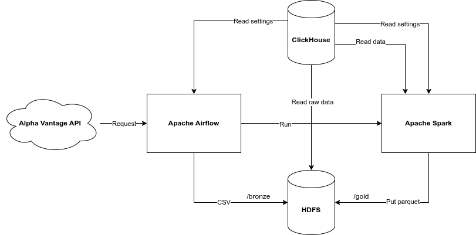

Всё окружение будет устанавливаться на локальной либо на виртуальной машине. В моем случае это

- [Hadoop 3.2.1](https://hadoop.apache.org/docs/stable/hadoop-project-dist/hadoop-common/SingleCluster.html#Pseudo-Distributed_Operation) - нужен для организации озера данных на основе HDFS. 
- [Airflow 2.5.0](https://airflow.apache.org/docs/apache-airflow/stable/start.html) - имеет удобный графический интерфейс и возможность писать код на Python.
- [Spark 3.3.1](https://spark.apache.org/downloads.html) - быстрая обработка данных, лучше чем MapReduce.
- [ClickHouse 22.11.2](https://clickhouse.com/docs/ru/getting-started/install/) - можно настроить на папку в HDFS как в Hive Metastore. Быстро делает выборки.

*(ClickHouse пришлось перенастроить на порт 9001, потому что 9000 занят HDFS)*

Структура хранения данных:
- Сырой слой данных - папка '/bronze' в HDFS
- Промежуточный слой - таблицы в ClickHouse
- Слой витрин - папка '/gold' в HDFS

## Схема работы Airflow

Скрипты загрузки данных в 2-х режимах:
 - Инициализирующий – загрузка полного слепка данных источника за месяц
 - Инкрементальный – загрузка дельты данных за прошедшие сутки

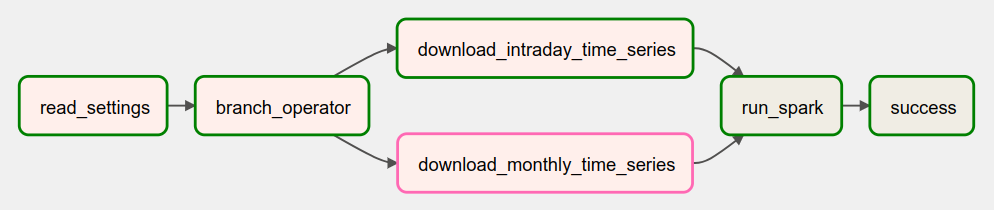

Описание шагов:
1. **read_settings** - чтение акций, которые необходимо загрузить и других настроек
1. **branch_operator** - проверяет значение переменной *time_series_interval*. Если она равна INTRADAY, то будет чтение за один день, в противном случае за месяц.
1. **download_intraday_time_series** - чтение данных за один день из Alpha Vantage в  HDFS папку '/bronze'
1. **download_monthly_time_series** - чтение данных за один месяц из Alpha Vantage в HDFS папку '/bronze'
1. **run_spark** - Spark читает эти данные из ClickHouse, строит витрину, результат пишет в виде parquet файла в HDFS папку '/gold'
1. **success** - сообщение об успешном выполнении задания


## Структура БД
- **time_series** - таблица с каждодневной информацией
- **vw_time_series** - представление с уникальными строками из time_series
- **settings** - различные настройки приложения

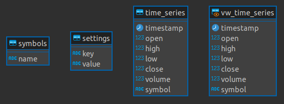

Скрипт иницилизации находится [здесь](./clickhouse/).


## HDFS

### Инициализация

```bash
hdfs namenode -format
start-dfs.sh
hdfs dfs -mkdir /bronze
hdfs dfs -mkdir /gold
hdfs dfsadmin -safemode leave
# если нужно остановить, то stop-dfs.sh
```

### Структура

```bash
├── bronze      # сырые данные в виде csv файлов
└── gold        # готовые витрины в виде parquet файлов
```


## Airflow

**pip** пакеты для работы DAG
- clickhouse_driver
- apache-airflow
- alpha_vantage

<details>
  <summary>Инициализация</summary>

```bash
# Airflow needs a home. `~/airflow` is the default, but you can put it
# somewhere else if you prefer (optional)
export AIRFLOW_HOME=~/airflow

# Install Airflow using the constraints file
AIRFLOW_VERSION=2.5.0
PYTHON_VERSION="$(python --version | cut -d " " -f 2 | cut -d "." -f 1-2)"
# For example: 3.7
CONSTRAINT_URL="https://raw.githubusercontent.com/apache/airflow/constraints-${AIRFLOW_VERSION}/constraints-${PYTHON_VERSION}.txt"
# For example: https://raw.githubusercontent.com/apache/airflow/constraints-2.5.0/constraints-3.7.txt
pip install "apache-airflow==${AIRFLOW_VERSION}" --constraint "${CONSTRAINT_URL}"

# set your key
export ALPHAVANTAGE_KEY=...

# The Standalone command will initialise the database, make a user,
# and start all components for you.
airflow standalone

# Visit localhost:8080 in the browser and use the admin account details
# shown on the terminal to login.
# Enable the example_bash_operator dag in the home page
```
</details>

## Результаты разработки

В результате был создан проект со следующей структурой:

```bash
├── airflow         # исходный код для DAG
├── clickhouse      # скрипты для ClickHouse
├── docs            # документация, презентация
├── elasticsearch   # скрипты для elasticsearch
├── images          # диаграммы, картинки
└── spark           # исходный код для Spark
```
Пример витрины данных:

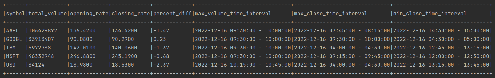

## ElasticSearch, Kibana

Чтобы результаты было удобнее смотреть, Spark так же выгружает данные в ElasticSearch в индекс **task2**.

Для установки воспользуемся скриптом *docker-compose.yml* из папки [elasticsearch](./elasticsearch/docker-compose.yml)

В результате получим

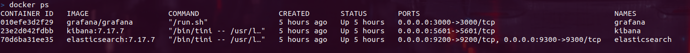

Зайдем в Kibana и добавим **index pattern** для нашего индекса по полю **date** нашего индекса **task2**, который содержит дату котировок

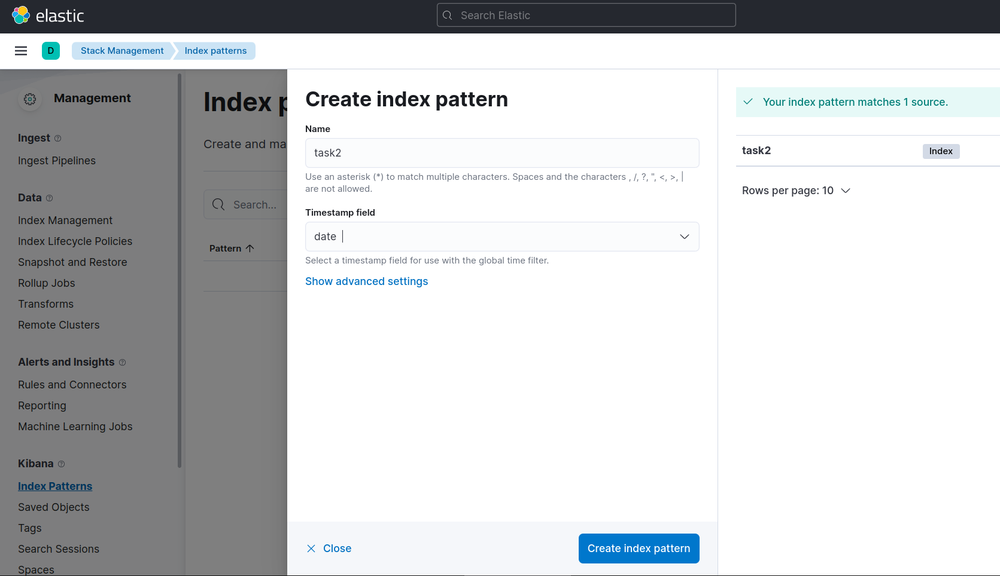

После этого данные из меню Discover можно сортировать по всем полям. Например, посмотрим данные за последние пять дней

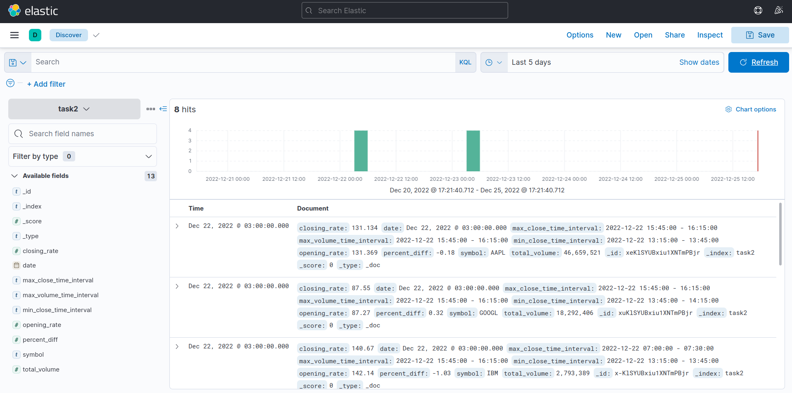

## Grafana

Так же витрину можно просмотреть в Grafana. Она устанавливается тем же скриптом, что и ElasticSearch.

По-умолчанию реквизиты для входа admin/admin.

### ClickHouse

Можно установить плагин для [ClickHouse](https://grafana.com/grafana/plugins/grafana-clickhouse-datasource/), а потом добавить его через *Data sources -> Add data source -> ClickHouse*

| Key | Value |
| ----------- | ----------- |
| Server address | host.docker.internal |
| Server port | 9001 |
| Username | default |
| Default database | de |


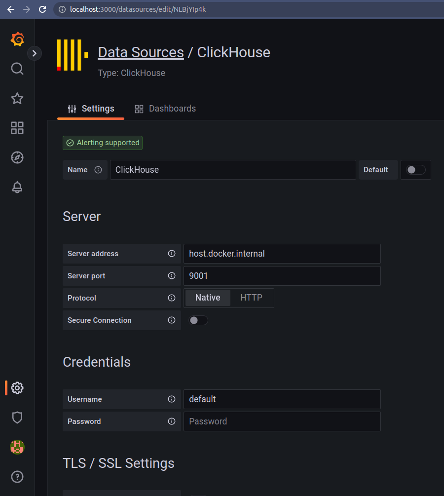

На вкладке **Dashboards** можно импортировать разные красивые дашборды.

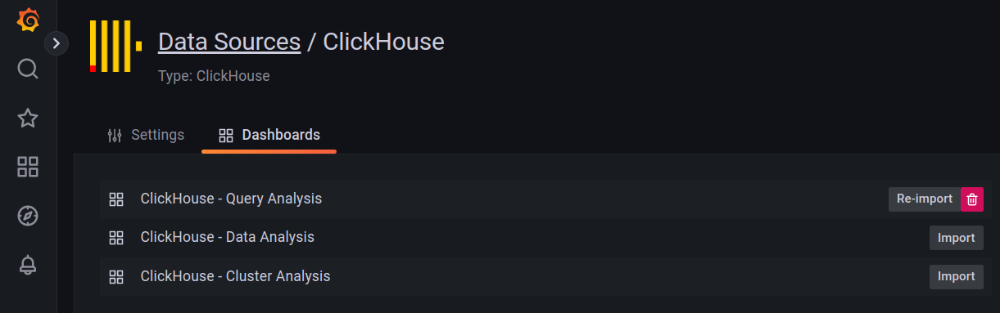

Например **Query Analysis**

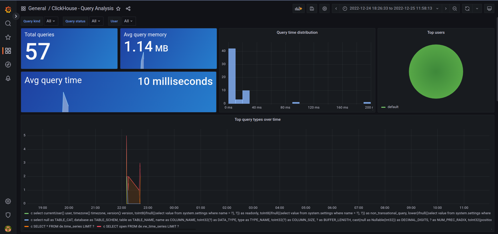

### ElasticSearch

А можно брать данные из **ElasticSearch**. Добавляется так же через *Data sources -> Add data source -> Elasticsearch*

 Key | Value |
| ----------- | ----------- |
| URL | http://elasticsearch:9200 |
| Index name | task2 |
| Time field name | date |
| ElasticSearch version | 7.10+ |

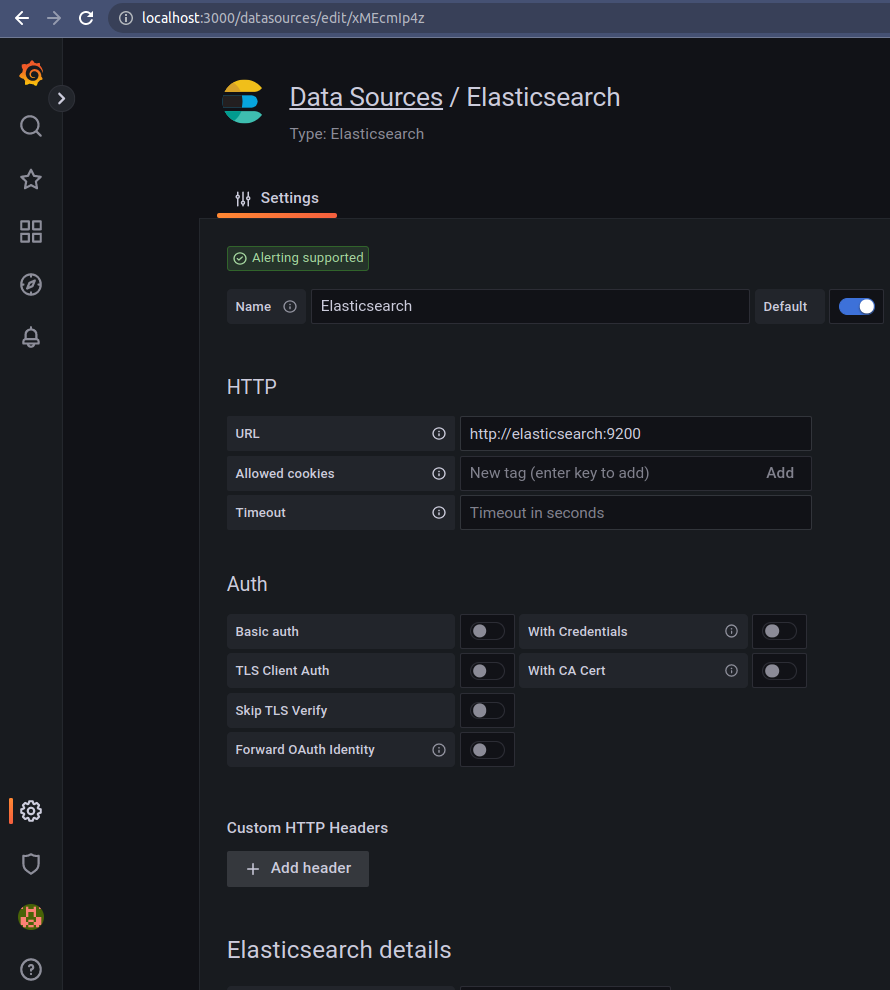

